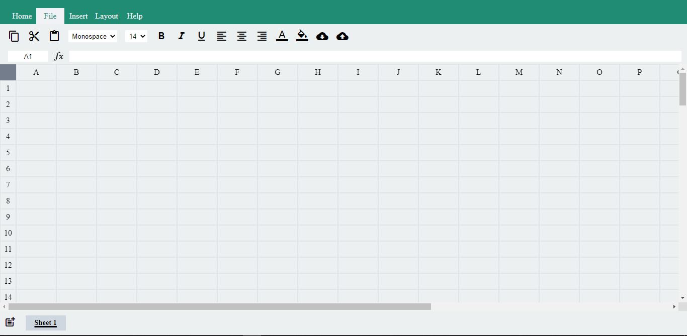

# Google-Spreadsheet-Clone

A google Google Spread Sheet Clone with formula evaluation, cycle detection and much more

# [Google-Spreadsheet-Clone](https://devmohit-live.github.io/Google-Spreadsheet-Clone/) ⭐

## Overview 👀
 

- **Data and Cell Formatting 👨‍💻**
- **Use Formulas / basic Maths 💻**
- **Detects Cycle in Formula and can trace back the cyclic path 📹**
- **Can create Multiple sheets ⚡**
- **Save/ Download and Upload of Sheets are possible ⚡**

## How it works? 🤔

- **open the website [https://devmohit-live.github.io/Google-Spreadsheet-Clone/](https://devmohit-live.github.io/Google-Spreadsheet-Clone/)**
- **Ready to perform basic spreadsheet operations**

## Working 💻

- ### Formatting of Cells and Data

  

- ### Cut/Copy/Paste Upload and Download

  

- ### Formulae Evaluation

  

- ### Cycle Detection

  

- ### Cyclic Path trace

  

